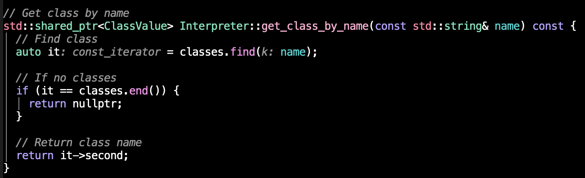

+++
title = "The TSharp Programming Language: Lessons Learned"
date = "2026-06-12T10:00:00+10:00"
author = "Dylan Armstrong"
description = "T# is a pet project of mine that I started building on/off since 2025, however my honours supervisor and I decided that I should start working on it again to understand how ANTLR works, which that (or JavaCC) will be one of the key technologies that we will be using throughout our DSL honours project."
readingTime = true
draft = false
tags = ["article", "code"]
+++

*This article, written by club member Dylan outlines his work in creating an object-orientated turing-complete procedural programming language. You can find his personal website [here](https://dylanarmstrong.net/).*

**Contents**


## Introduction

T# is a pet project of mine that I started building on/off since 2025, however my honours supervisor and I decided that I should start working on it again to understand how ANTLR works, which that (or JavaCC) will be one of the key technologies that we will be using throughout our DSL honours project. T# is designed to be extremely similar to C#, but with some slight differences (and no, this project will not take over the world - as I said before, it was preparation for my honours project in 2027):
- No semi-colons.
- No type name on constructors (the interpreter can pick up the class name from the class definition, so there is no need to type the type twice: once in a class definition, and the other in a constructor).
- Arrow (lambda) property getters (for simpler return statements in T#, compared to C#).
- C++ style array syntax e.g. fixed size: `int arr[5]` or dynamic size: `int arr[]`.

T# uses ANTLR for lexer and parser generation and is a statically typed mixed-paradigm (OO, generic and procedural) programming language.
## What is JavaCC and ANTLR?

ANTLR stands for ANother Tool for Language Recognition. JavaCC and ANTLR are both lexer and parser generators. A lexer, generates the tokens (or words) in the language. The parser on the other hand, yields a special type of tree called an AST (Abstract Syntax Tree) which contains the structure of a program in a programming language in a tree format. Instead of manually writing out a lexer and parser, you can use ANTLR (or JavaCC) to generate one. In ANTLR, I define a grammar - which then can be used to generate a lexer/parser.

{{< inset-img src="images/img1.png" alt="The above image is the first 15 or so lines of the T# grammar specification, containing the program rule, and the top level declaration rule - which can consist of functions declarations, class, interface, enum or global variable declarations." caption="*The above image is the first 15 or so lines of the T# grammar specification, containing the program rule, and the top level declaration rule - which can consist of functions declarations, class, interface, enum or global variable declarations.*">}}



After I have this grammar specification the way I want it, I can run this command via the ANTLR4 runtime, to generate a lexer and parser in many languages such as Go, C#, Python, Java, C++, Swift, Dart, etc:

I chose C++ for this project, due to it's performance and greater control over memory. I am also using the visitor pattern, which is useful in preparation for my honours project - as that is what we are using.

All that is left to do now, is write the interpreter. ANTLR deals with the complexity of lexer and parser generation for you.

## Implementation of Interpreter

The interpreter of T# is massive - approximately 1400 lines of C++ in the compilation unit. The interpreter uses the visitor OO design pattern and has a header file, which contains the specification, with the definition of all functions located in the C++ compilation unit file.

Since the interpreter is massive, I will only focus on one specific function for this blog post:

This is the get_class_by_name function - which is a helper function to get a class by name. Classes are stored as a private member variable in the Interpreter class. They are stored under a `std::undordered_map`of key `std::string` (the class name) and a shared pointer to a `ClassValue` type for the value of the map.

This function is pretty simple. It's purpose is to find the class by name in the classes map. Then return the value (the second part (or value) of the item), and if there are no classes, return a `nullptr`.

The interpreter contains several functions (helper functions such as the function above) but also methods for registration of classes, getting member functions, constructing objects (calling the constructor), etc.

## Results

My friend Ash and I, on a Discord voice call one night tested a Conway's Game of Life glider. This was a simple test to work out whether the language was a) Turing complete and b) how well it performs. The answers? Yes (most likely) and VERY SLOW!

T# performed the test in roughly over 1 sec (for 15 generations of a glider). This is very slow for a such a small number of generations. However, it did work. This means that the language could very well be Turing complete.
new l
## Lessons Learned

Next time, if I was developing an interpreted programming language - I would definitely use a byte code system behind a virtual machine (similar to Java's JVM) to make the performance better with a byte-code like language in between.

The point is: the architecture of the tree-walking interpreter is not optimised for performance. However, for a first language/pet project it definitely does the job, is (most likely) Turing complete and most importantly, it works.

## Conclusion and Acknowledgments

**Special thanks to Ash for developing the Conway's Game of Life Glider test for T#.**

Dylan Armstrong is an aspiring researcher in Machine Learning / Software Engineer and Support Technician with 5 years of industry experience - and is studying a double Bachelor's degree in Computer Science - Software Development (Honours) and Science - Applied Mathematics at Swinburne University of Technology.

My website: https://dylanarmstrong.net

View the documentation here: https://tsharp.dylanarmstrong.net

GitHub repo: https://github.com/da-2115/tsharp

*This post is was contributed by Dylan Amstrong. You can find his personal website [here](https://dylanarmstrong.net/)*.
